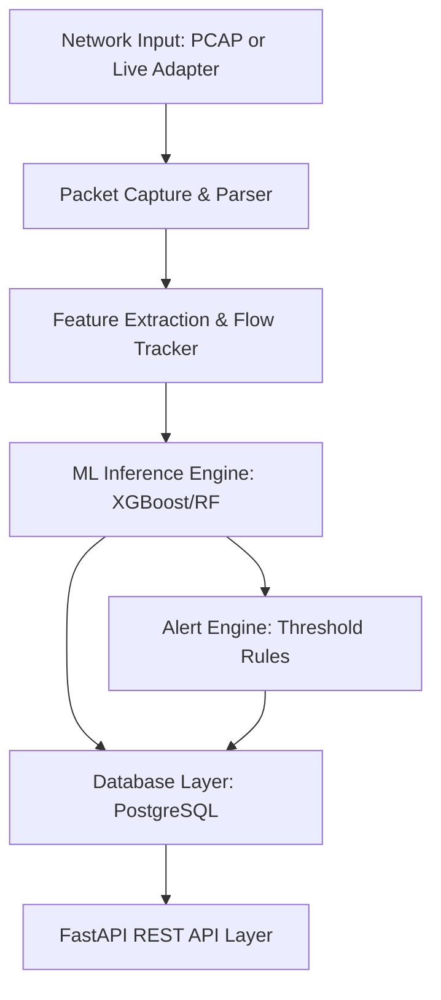
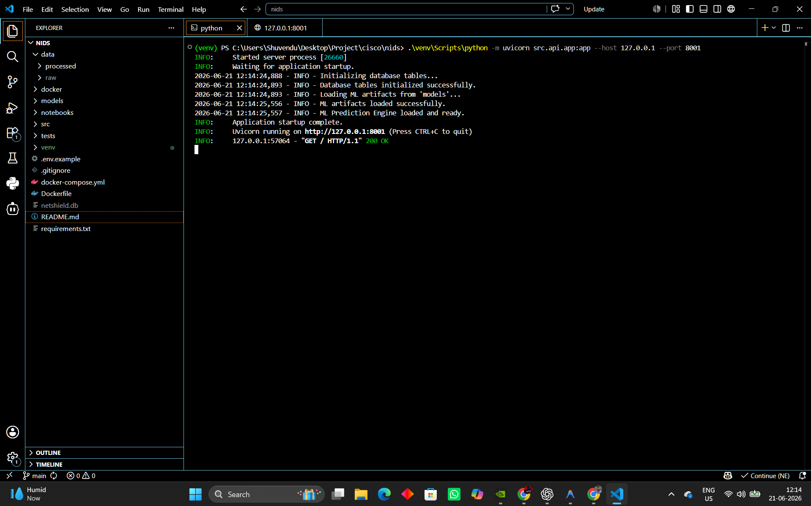
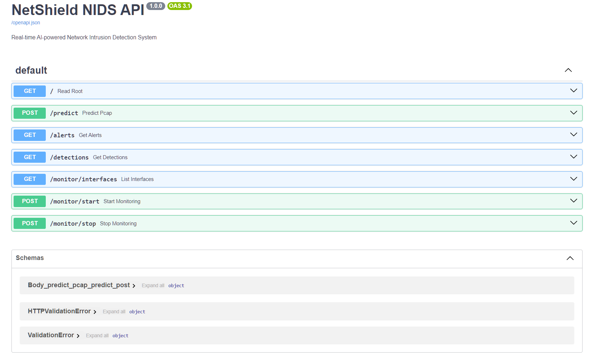
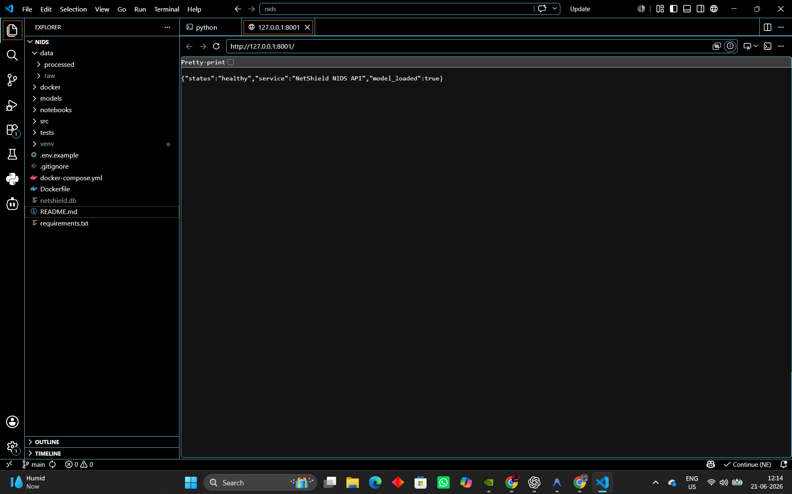
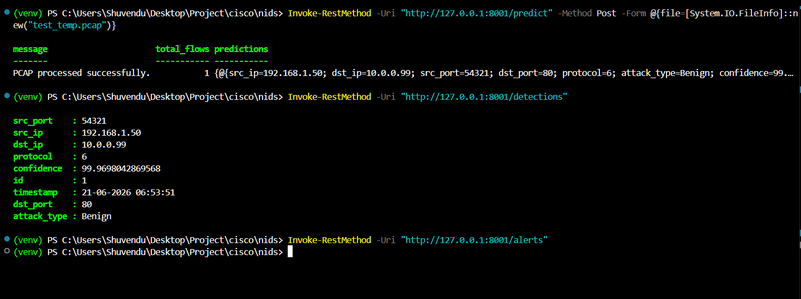
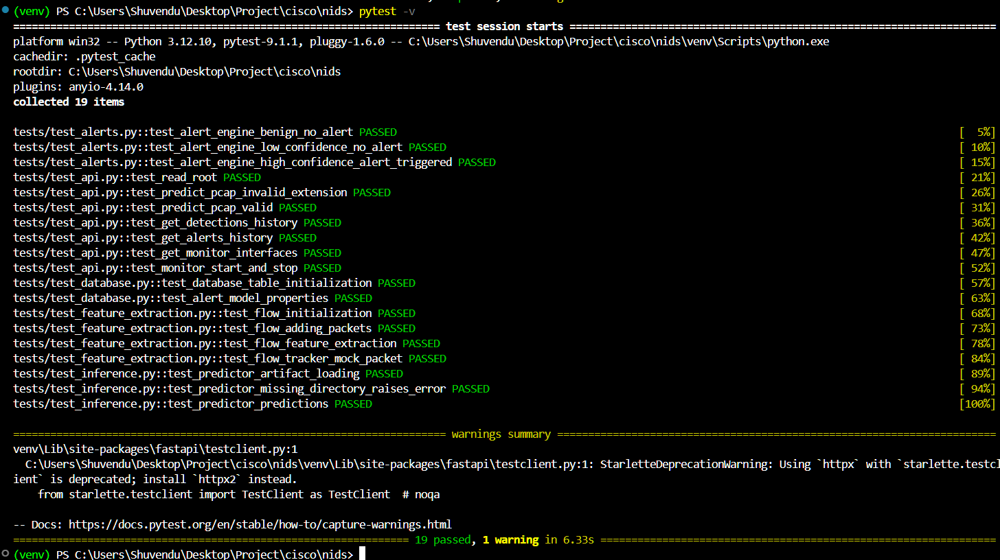

# NetShield: AI-Powered Network Intrusion Detection System (NIDS)

NetShield is a production-grade, AI-powered Network Intrusion Detection System (NIDS) designed to analyze network traffic and classify cyber threats in real time. Combining low-level packet capture technologies, flow tracking, and machine learning classifiers, NetShield automatically parses raw network traffic (PCAP files or live network adapters), performs feature extraction, classifies the flows, alerts on malicious traffic, and records all historical logs into a PostgreSQL database.

---

## 1. Project Overview
In modern security operations, traditional signature-based detection systems (like Snort or Suricata) struggle to capture zero-day attacks or polymorphic threats. NetShield addresses this gap by utilizing supervised Machine Learning models (Random Forest & XGBoost) trained on network traffic characteristics.

### Key Objectives:
* **Zero Frontend Footprint**: Pure backend API system with interactive Swagger documentation.
* **Dual Monitoring Modes**: Seamless support for both offline PCAP file forensic uploads and real-time live network sniffing.
* **Stateful Flow Tracking**: Reconstructs TCP/UDP packets into bidirectional flows.
* **Deterministic Security Alerting**: Separates benign alerts from verified threats using configurable confidence and severity thresholds.
* **Docker Ready**: Pre-configured multi-container stack featuring auto-linked FastAPI and PostgreSQL services.

---

## 2. System Architecture
NetShield is built with a highly modular, decoupled architecture consisting of 6 core subsystems:



### Core Subsystems:
1. **Packet Parser (`src/packet_capture`)**: 
   Uses Scapy’s streaming capabilities (`PcapReader`) to parse packet layer attributes without loading large PCAP files fully into memory. Live monitoring runs Scapy's sniffing loop inside a background execution thread.
2. **Feature Extraction (`src/feature_extraction`)**: 
   States are maintained for bidirectional network connections defined by a 5-tuple key `(Src IP, Src Port, Dst IP, Dst Port, Protocol)`. When a packet arrives, flow statistics (e.g., duration, byte counts, packets/sec, TTL averages, TCP flag combinations) are updated in real time.
3. **ML Inference Engine (`src/inference`)**: 
   Loads serialized model weights (`model.pkl`), scalers, and label encoders. It transforms the raw 11 network flow features into standardized inputs and returns prediction probabilities.
4. **Alert Engine (`src/alerts`)**: 
   Monitors prediction results. If the prediction is non-Benign and its probability exceeds $90\%$, it triggers a high-severity alert.
5. **Database Integration (`src/database`)**: 
   Provides SQLAlchemy ORM mappings for `DetectionHistory` and `Alert` tables, supporting SQLite locally for rapid testing and PostgreSQL inside production Docker environments.
6. **API Interface (`src/api`)**: 
   FastAPI routing layer exposing clean HTTP endpoints, handling lifespan initialization, validation schemas, and database dependencies.

---

## 3. Dataset & Feature Engineering
NetShield's classifiers are trained on the **CIC-IDS2017** dataset, which consists of benign traffic along with common family-specific network attacks.

### Class Labels:
* **Benign**: Standard non-malicious network traffic.
* **DDoS**: Distributed Denial of Service attacks.
* **PortScan**: Host discovery and vulnerability scanning attempts.
* **Bot**: Botnet Command and Control channel communication.
* **BruteForce**: Automated credentials cracking (SSH/FTP).
* **WebAttack**: SQL injection, Cross-Site Scripting (XSS), and brute-force directory traversal.

### Extracted Feature Schema (11 Features):
The exact same feature extraction schema is guaranteed across training, PCAP upload parsing, and live network capture:

| Feature Name | Description | Layer Source |
|---|---|---|
| **Protocol** | Transport layer protocol ID (e.g., TCP=6, UDP=17) | IP Layer |
| **Source Port** | Source connection port | TCP/UDP Layer |
| **Destination Port** | Destination connection port | TCP/UDP Layer |
| **Packet Length** | Average size of all packets in the flow | IP/Ether Layer |
| **TTL** | Average Time to Live of packets | IP Layer |
| **TCP Flags** | Bitwise OR accumulation of all observed TCP control flags | TCP Layer |
| **Flow Duration** | Time difference between first and last packet in microseconds | System/Packet Time |
| **Packets Per Second** | Total packets sent divided by flow duration | Calculated |
| **Bytes Per Second** | Total bytes sent divided by flow duration | Calculated |
| **Forward Packets** | Count of packets traveling source $\rightarrow$ destination | Calculated |
| **Backward Packets** | Count of packets traveling destination $\rightarrow$ source | Calculated |

---

## 4. Local Installation Guide

### Prerequisites
* Python 3.10+
* System Packet Capturing Drivers:
  * **Windows**: Install [Npcap](https://npcap.com/) (Make sure to check "Install Npcap in WinPcap API-compatible Mode").
  * **Linux**: Install libpcap: `sudo apt-get install libpcap-dev`
  * **macOS**: Install libpcap: `brew install libpcap`

### Local Development Setup:
1. Clone the project and navigate to the project directory:
   ```bash
   cd NetShield
   ```
2. Create and activate a Python virtual environment:
   ```bash
   python -m venv venv
   # On Windows (PowerShell):
   venv\Scripts\Activate.ps1
   # On Linux/macOS:
   source venv/bin/activate
   ```
3. Install the dependencies:
   ```bash
   pip install -r requirements.txt
   ```
4. Copy the environment template:
   ```bash
   copy .env.example .env
   ```
5. *(Optional)* Run the model training pipeline if you want to regenerate models:
   ```bash
   python -m src.training.train
   ```
6. Start the local development server (uses SQLite by default):
   ```bash
   uvicorn src.api.app:app --reload --host 127.0.0.1 --port 8000
   ```



---

## 5. Docker Deployment Setup
NetShield is fully containerized with Docker and Docker Compose, compiling all dependencies and mounting an isolated PostgreSQL database.

### Spin up the environment:
```bash
docker compose up --build
```
This launches:
* `netshield_db`: A PostgreSQL service exposing port `5432` with volume persistence.
* `netshield_web`: The FastAPI service exposing port `8000` (depends on `netshield_db` healthcheck).

### Sniffing Host Adaptors inside Docker (Linux Only):
By default, Docker containers operate on isolated virtual networks. To run live sniffing on the host's actual network interfaces inside a container, uncomment the network configuration options inside `docker-compose.yml`:
```yaml
    # network_mode: "host"
    # cap_add:
    #   - NET_ADMIN
```

---

## 6. API Documentation & Swagger Usage

When the server is running, the interactive OpenAPI Swagger page is available at:
 **[http://localhost:8000/docs](http://localhost:8000/docs)**



### Summary of REST API Endpoints:

#### 1. System Health
* **Method**: `GET`
* **Route**: `/`
* **Response**:
  ```json
  {
    "status": "healthy",
    "service": "NetShield NIDS API",
    "model_loaded": true
  }
  ```



#### 2. PCAP Traffic Analysis & Classification
* **Method**: `POST`
* **Route**: `/predict`
* **Payload**: Form-Data (`file`: `.pcap` or `.pcapng` format)
* **Response**:
  ```json
  {
    "message": "PCAP processed successfully.",
    "total_flows": 1,
    "predictions": [
      {
        "src_ip": "192.168.1.50",
        "dst_ip": "10.0.0.99",
        "src_port": 54321,
        "dst_port": 80,
        "protocol": 6,
        "attack_type": "Benign",
        "confidence": 99.96
      }
    ]
  }
  ```

#### 3. Fetch Stored Detections
* **Method**: `GET`
* **Route**: `/detections`
* **Parameters**: `limit` (default: 100), `offset` (default: 0)

#### 4. Fetch Security Alerts
* **Method**: `GET`
* **Route**: `/alerts`
* **Parameters**: `limit` (default: 100), `offset` (default: 0)

#### 5. List Interfaces
* **Method**: `GET`
* **Route**: `/monitor/interfaces`

#### 6. Start Live Sniffing
* **Method**: `POST`
* **Route**: `/monitor/start`
* **Parameters**: `interface` (Query string)

#### 7. Stop Live Sniffing
* **Method**: `POST`
* **Route**: `/monitor/stop`
* **Parameters**: `interface` (Query string)

#### API Interaction Examples (PowerShell)



---

## 7. Automated Testing Suite
NetShield comes with a complete suite of unit and integration tests using `pytest` to ensure database connections, API routing, and machine learning components continue to work as updates are deployed.

To run the tests:
```bash
pytest -v
```



The test coverage spans:
1. **conftest.py**: Shared testing context creating in-memory SQLite instances using `StaticPool`.
2. **test_alerts.py**: Validates alert engine alerting threshold rules.
3. **test_api.py**: Tests API endpoint routing and request validation schemas.
4. **test_database.py**: Checks ORM models, field definitions, and DB operations.
5. **test_feature_extraction.py**: Confirms Scapy packet decoding and flow statistics.
6. **test_inference.py**: Validates model artifact loading and model prediction.

---

## 8. Future Improvements & Production Roadmaps
* **Distributed Sniffing**: Deploy lightweight packet capture agents (e.g., Scapy/eBPF-based) on target hosts that forward raw flow metrics to a centralized NetShield prediction microservice.
* **Unsupervised Anomaly Detection**: Add Autoencoder models to detect completely new, zero-day threat patterns that do not fit into known CIC-IDS2017 supervised labels.
* **Notification Integration**: Extend the Alert Engine to push high-confidence detections to messaging webhooks (Slack/Teams) or syslog managers (SIEM).
* **IP Blocking Actions**: Add active response integrations to dynamically write iptables/firewall rules to drop traffic from IP addresses flagged with multiple malicious alerts.
